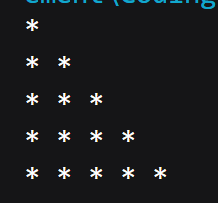

# Coding Prepation Tatvasoft

## Pattern Printing Practice

### 1. Problem Statement

    Print Increasing Triangle Pattern
Code :

``` java
public class inc_tri {
    public static void main(String[] args) {
      int n = 5;
         for(int i = 1; i <= n;i++){
            for(int j = 1; j <= i ; j++){
                System.out.print("* ");
            }
            System.out.println();
         }
    }
}
```

Output :



### 2. Problem Statement

    Print Decreasing Triangle Pattern
Code :

``` java
public class dec_tri {
    public static void main(String[] args) {
        int n = 5;
        for (int i = 1; i <= n; i++) {
            for (int j = i; j <= n; j++) {
                System.out.print("* ");
            }
            System.out.println();
        }
    }
}
```

Output :


### 3. Problem Statement

    Print Right Sided Increasing Triangle Pattern.
Code :
``` java
public class r_inc_tri {
    public static void main(String[] args) {
        int n = 5;
        for(int i = 1;i<=n;i++){
            for(int j = i; j<= n;j++){
                System.out.print("  ");
            }
            for(int j = 1;j<=i;j++){
                System.out.print("* ");
            }
            System.out.println();
        }
    }
}
```

Output :


### 4. Problem Statement

    Print Right Sided Decreasing Triangle Pattern.
Code :
``` java
public class r_dec_tri {
    public static void main(String[] args) {
        int n = 5;
        for (int i = 1; i <= n; i++) {
            for(int j = 1; j <= i;j++){
                System.out.print("  ");
            }
            for(int j = i; j <= n;j++){
                System.out.print("* ");
            }
            System.out.println();
        }

    }
}
```

Output :


### 5. Problem Statement
  
    Print Pascal Triangle Pattern.
Code :
``` java
public class pascal_tri {
    public static void main(String[] args) {
        int n = 5;
        for(int i = 1;i<=n;i++){
            for(int j = i; j<= n;j++){
                System.out.print(" ");
            }
            for(int j = 1;j<=i;j++){
                System.out.print("* ");
            }
            System.out.println();
        }
    }
}
```

Output :


### 6. Problem Statement

    Print Downside Pascal Triangle Pattern.
Code :

``` java
public class pascal_tri_down {
    public static void main(String[] args) {
        int n = 5;
        for (int i = 1; i <= n; i++) {
            for (int j = 1; j <= i; j++) {
                System.out.print(" ");
            }
            for (int j = i; j <= n; j++) {
                System.out.print("* ");
            }
            System.out.println();
        }
    }
}
```

Output :


### 7. Problem Statement

    Print Diamond Pattern.
Code :
```java
public class diamond {
    public static void main(String[] args) {
        int n = 5;
        for(int i = 1;i<=n;i++){
            for(int j = i;j<=n;j++){
                System.out.print(" ");
            }
            for(int j = 1;j<i;j++){
                System.out.print("* ");
            }
            System.out.println();
        }
        for(int i = 1;i<=n;i++){
            for(int j = 1;j< i;j++){
                System.out.print(" ");
            }
            for(int j = i;j<=n;j++){
                System.out.print("* ");
            }
            System.out.println();
        }
    }
}
```

Output :


### 8. Problem Statement

    Print SandClock Pattern.
Code :
```java
public class sandClock {
    public static void main(String[] args) {
        int n = 5;
        for(int i = 1;i<=n;i++){
            for(int j = 1;j<=i;j++){
                System.out.print(" ");
            }
            for(int j = i; j<=n;j++){
                System.out.print("* ");
            }
            System.out.println();
        }
        for(int i =1;i<=n;i++){
            for(int j = i;j<=n;j++){
                System.out.print(" ");
            }
            for(int j = 1;j<=i;j++){
                System.out.print("* ");
            }
            System.out.println();
        }
    }
}
```

Output :


